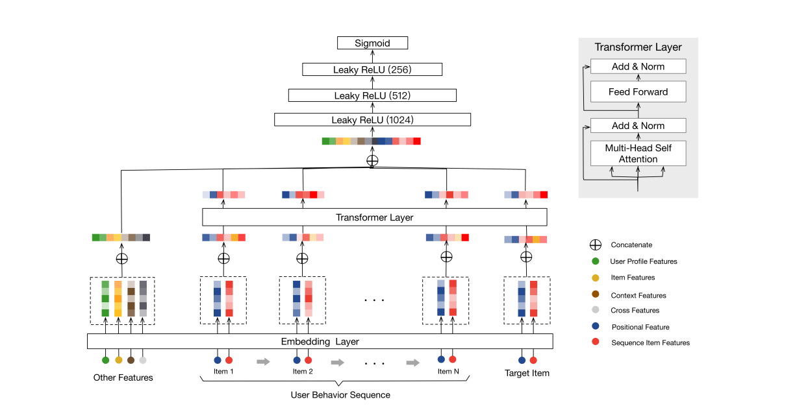

# Behavior-Sequence-Transformer-Pytorch
This is a pytorch implementation for the BST model from Alibaba https://arxiv.org/pdf/1905.06874.pdf

This model is a novel recommender architecture based on seq2seq models. We translate user behaviour into sequences and predict a rating for each target item (movie).
# Dataset
For this implementation we used Movielens [1M Dataset](https://movielens.org/) that contains timestamps per each rating, making it perfect to test in the sequence recommendation model.

# Running
The model architecture is contained on `pytorch-best.ipynb`. If you want to run it you would need to run the notebook `prepare_data.ipynb` first as it will download and preprocess the dataset.

# Results
Experiments running, will update later

# References

* Original paper [1](https://arxiv.org/pdf/1905.06874.pdf)
* Keras implementation [2](https://keras.io/examples/structured_data/movielens_recommendations_transformers/)
* Tensorflow implementation [3](https://github.com/shenweichen/DeepCTR/blob/master/deepctr/models/bst.py)
